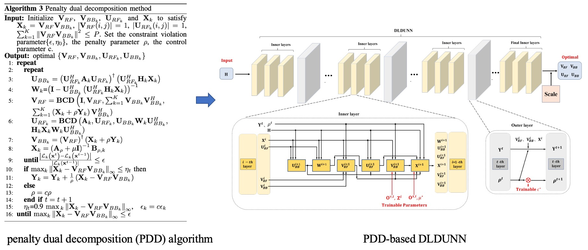

# DLDUNN
This repository contains the code for [Hybrid Precoding Design Based on Dual-Layer Deep-Unfolding Neural Network](https://ieeexplore.ieee.org/document/9569633) (IEEE PIMRC 2021). Slides can be seen [here](https://fuxiao0719.github.io/assets/pdf/pimrc_dldunn.pdf).

## Pipeline


## Requirements
* Python >= 3.6
* PyTorch >= 1.1.0

## File Introduction
`run.py`: Main program that implements the training and testing stages; 

`model.py`: The detailed design of Dual-Layer Deep-Unfolding Neural Network (DLDUNN).

`complex_matrix.py`: Replace complex matrix operations with differentiable tensor operations that splits real and imaginary parts into two dimensions.

`pdd.py`: The implementation of the penalty dual decomposition (PDD) algorithm.

## Usage
* Run the  penalty dual decomposition (PDD) algorithm on complex Gaussian MIMO channel.
```bash
python pdd.py --cfg_file lib/dldunn.yaml K 2 M 2 N 4 M_RF 2 N_RF 4
```
* Run the DLDUNN model. For easier verification, if we set K=2, M=2, N=4, M_RF=2, N_RF=4, D_in=4, D_out=2 here, we can achieve PDD's result (15.935bps/Hz) and DLDUNN's result (15.891bps/Hz). These parameters can be manually changed to match the paper. Initialization will affect the convergence of the model, try to re-initialize the model when the network falls into local optimal region.
```bash
python run.py --cfg_file lib/dldunn.yaml K 2 M 2 N 4 M_RF 2 N_RF 4 D_in 4 D_out 2
```

## Cite
```
@inproceedings{zhang2021hybrid,
  title={Hybrid Precoding Design Based on Dual-Layer Deep-Unfolding Neural Network},
  author={Zhang, Guangyi and Fu, Xiao and Hu, Qiyu and Cai, Yunlong and Yu, Guanding},
  booktitle={2021 IEEE 32nd Annual International Symposium on Personal, Indoor and Mobile Radio Communications (PIMRC)},
  pages={678--683},
  year={2021},
  organization={IEEE}
}
```
